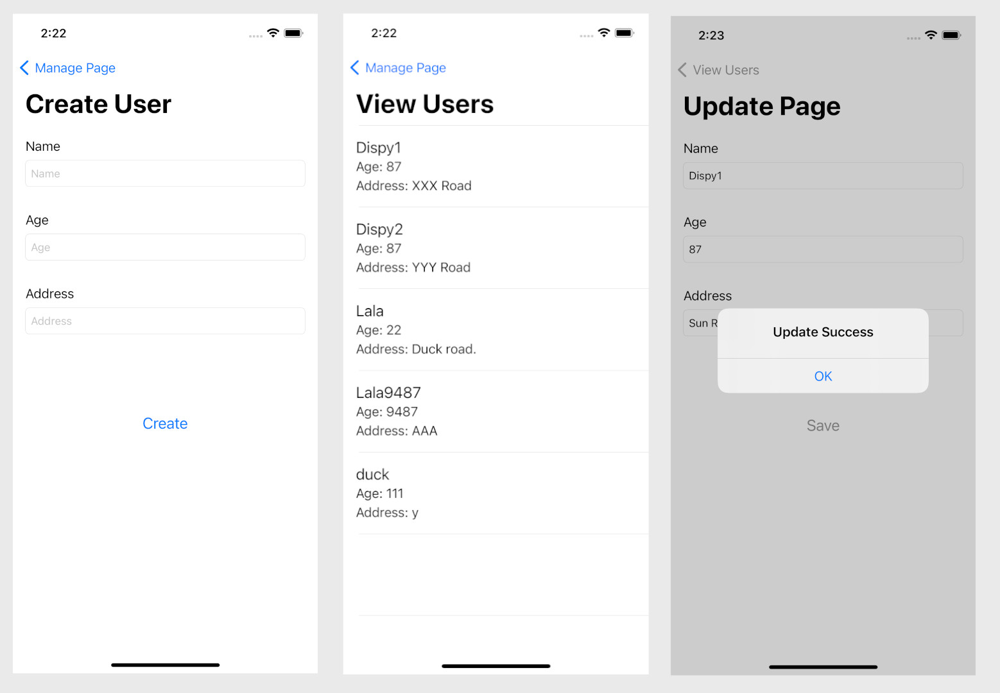

# Realm Demo for iOS

This is a demo to show how to use Realm for iOS.

Realm is database plugin for iOS, Android, web by MongoDB.

# Features
The project will demo these function:
- Create
- Read and filter data
- Update
- Delete

# Technical Specifications
- Language: Swift 5
- IDE: Xcode 12.4
- Package Management: Swift Package Manager